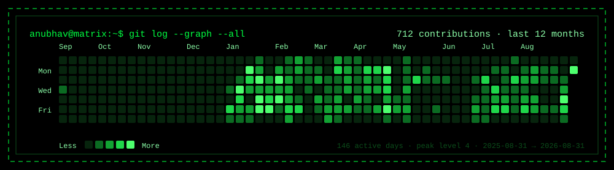
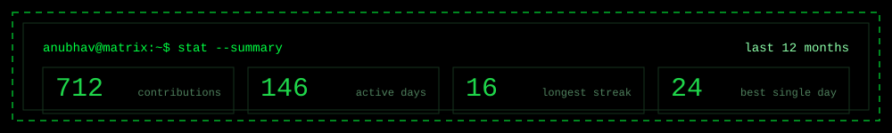
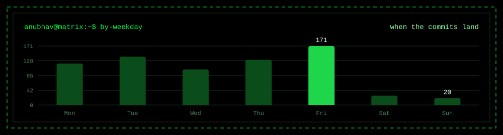

<picture>
  <source media="(prefers-color-scheme: dark)"  srcset="./banner-dark.svg">
  <source media="(prefers-color-scheme: light)" srcset="./banner-light.svg">
  
</picture>

  

<picture>
  <source media="(prefers-color-scheme: dark)"  srcset="./contrib-dark.svg">
  <source media="(prefers-color-scheme: light)" srcset="./contrib-light.svg">
  
</picture>

 

<picture>
  <source media="(prefers-color-scheme: dark)"  srcset="./stats-dark.svg">
  <source media="(prefers-color-scheme: light)" srcset="./stats-light.svg">
  
</picture>

 

<picture>
  <source media="(prefers-color-scheme: dark)"  srcset="./weekdays-dark.svg">
  <source media="(prefers-color-scheme: light)" srcset="./weekdays-light.svg">
  
</picture>

The numbers behind the charts

| Month | Contributions |
|---|---|
| Aug 2025 | 0 |
| Sep 2025 | 1 |
| Oct 2025 | 0 |
| Nov 2025 | 0 |
| Dec 2025 | 3 |
| Jan 2026 | 159 |
| Feb 2026 | 106 |
| Mar 2026 | 85 |
| Apr 2026 | 110 |
| May 2026 | 47 |
| Jun 2026 | 21 |
| Jul 2026 | 94 |
| Aug 2026 | 86 |

| Weekday | Contributions |
|---|---|
| Mon | 120 |
| Tue | 140 |
| Wed | 103 |
| Thu | 131 |
| Fri | 171 |
| Sat | 27 |
| Sun | 20 |

Peak day: **2026-08-27** with **24** contributions ·
Average on an active day: **4.9** ·
Window: 366 days

**[browse all 21 repos](https://github.com/malikanubhav?tab=repositories)**  ·  **[linkedin.com/in/anubhav010](https://www.linkedin.com/in/anubhav010)**

<!-- Charts are snapshots generated by gencharts.py / gencontrib.py from the live
     profile. Also available but not shown: months-*.svg, cumulative-*.svg -->
