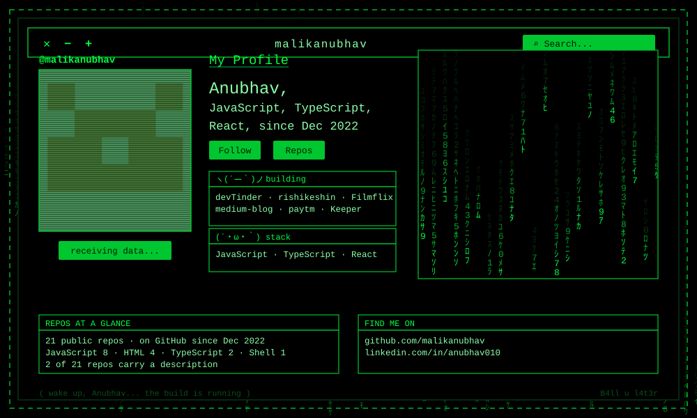

<div align="center">



</div>

```
anubhav@matrix:~$ whoami

  HANDLE     malikanubhav
  NAME       Anubhav
  TOP LANG   JavaScript · TypeScript · HTML · Shell
  SINCE      2022-12-31
  LINKS      linkedin.com/in/anubhav010

anubhav@matrix:~$ cat TODO.txt

  # ---- these lines are placeholders: replace them with your own ----
  BIO        <one line on what you actually work on>
  NOW        <what you are building this month>
  WANT       <what you would like to be contacted about>
  # ------------------------------------------------------------------

anubhav@matrix:~$ _
```

<div align="center">

`─────────────  T H E   S T A C K  ─────────────`

</div>

**`LANGUAGES GITHUB REPORTS`**

   

<div align="center">

`─────────────  P R O J E C T S  ─────────────`

</div>

| ░ | PROJECT | WHAT IT IS | LANG |
|---|---|---|---|
| `01` | [**Filmflix**](https://github.com/malikanubhav/Filmflix) | Movies and Shows streaming web application | `JavaScript` |
| `02` | [**rishikeshin**](https://github.com/malikanubhav/rishikeshin) | Everything you need to know about Rishikesh   | `TypeScript` |
| `03` | [**devTinder**](https://github.com/malikanubhav/devTinder) | _no description yet_ | `JavaScript` |
| `04` | [**devTinder-web**](https://github.com/malikanubhav/devTinder-web) | _no description yet_ | `JavaScript` |
| `05` | [**medium-blog**](https://github.com/malikanubhav/medium-blog) | _no description yet_ | `TypeScript` |
| `06` | [**paytm**](https://github.com/malikanubhav/paytm) | _no description yet_ | `JavaScript` |
| `07` | [**votingsystem**](https://github.com/malikanubhav/votingsystem) | _no description yet_ | `JavaScript` |
| `08` | [**acer-backlight**](https://github.com/malikanubhav/acer-backlight) | _no description yet_ | `Shell` |

<div align="center">

`─────────────  S Y S T E M   T E L E M E T R Y  ─────────────`

</div>

```
  ┌─ LANGUAGE DISTRIBUTION ────────────────────────────────────────────────────┐

  JavaScript    █████████████████████───────────────────   53.3%   8 repos
  HTML          ███████████─────────────────────────────   26.7%   4 repos
  TypeScript    █████───────────────────────────────────   13.3%   2 repos
  Shell         ███─────────────────────────────────────    6.7%   1 repo 

  └─ 19 own repos (2 forks) · since 2022-12-31 ────────────────────────┘
```

<div align="center">

`─────────────  F I N D   M E   O N  ─────────────`

[](https://github.com/malikanubhav) [](https://www.linkedin.com/in/anubhav010)


</div>

```
+------------------------------------------------------+
|   " There is no spoon. There is only the commit. "   |
|                                                      |
|   Open to collaborating on frontend and              |
|   full-stack side projects.                          |
|                                                      |
|   github.com/malikanubhav        B4ll u l4t3r        |
+------------------------------------------------------+
```
