<div align="center">

<picture>
  <source media="(prefers-color-scheme: dark)"  srcset="./matrix-profile-dark.svg">
  <source media="(prefers-color-scheme: light)" srcset="./matrix-profile-light.svg">
  
</picture>

</div>

<table>
<tr>
<td valign="top" width="34%">

### Shipping

<!-- projects starts -->
[**Filmflix**](https://github.com/malikanubhav/Filmflix) — `JavaScript`<br>
Movies and Shows streaming web application

[**rishikeshin**](https://github.com/malikanubhav/rishikeshin) — `TypeScript`<br>
Everything you need to know about Rishikesh

[**devTinder**](https://github.com/malikanubhav/devTinder) + [**web**](https://github.com/malikanubhav/devTinder-web) — `JavaScript`

[**medium-blog**](https://github.com/malikanubhav/medium-blog) — `TypeScript`
<!-- projects ends -->

</td>
<td valign="top" width="33%">

### Working in

`.js` `.ts` `.jsx` `.html` `.css` `.sh`

19 own repos, 2 forks.<br>
JavaScript 8 · HTML 4 · TypeScript 2 · Shell 1

First push `2022-12-31`.

</td>
<td valign="top" width="33%">

### Reach me

[linkedin.com/in/anubhav010](https://www.linkedin.com/in/anubhav010)

`ping` me about **JavaScript**, **TypeScript**, **React**, or anything in the list to the left.

</td>
</tr>
</table>

```
anubhav@matrix:~$ cat TODO.txt

  # placeholders — replace with your own words
  BIO   <one line: what you build, for whom>
  NOW   <what you are building this month>
  WANT  <what you want to be contacted about>

anubhav@matrix:~$ _
```
